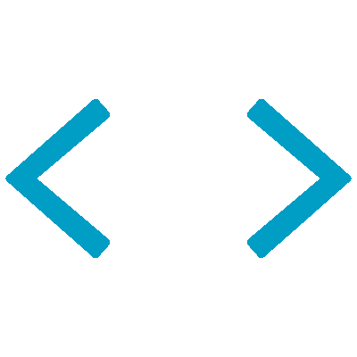
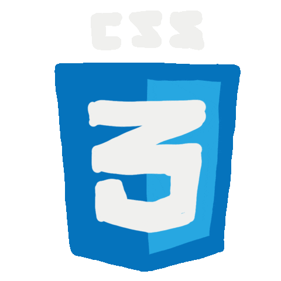
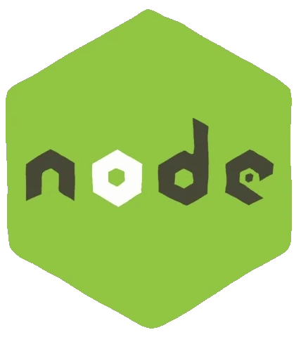
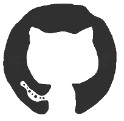

  
   
  

  <h1>Hi  , I'm Rudra Wagh</h1>
  
<strong>First-Year Engineering Student in Artificial Intelligence & Data Science (AI & DS)</strong>

  

> ### 💫 About Me
> - 🔭 **Focus:** Core engineering fundamentals, Python programming, and practical web applications.
> - 🌱 **Learning:** Data science libraries, algorithms, and modern software design.
> - 🤝 **Open to:** Beginner-friendly open-source repositories, AI tool projects, and student hackathons.
> - 💬 **Ask me about:** Python, web basics, AI/ML concepts, and tech hardware.
> - ⚡ **Fun Fact:** Teaching machines how to learn while figuring out how I learn best!

  

<h3>Tech Stack & Skills &nbsp;</h3>

<strong>Languages &amp; Frameworks</strong>

  &nbsp;
  &nbsp;
  &nbsp;
  &nbsp;
  &nbsp;
  &nbsp;
  &nbsp;
  

<strong>Tools &amp; Creative Software</strong>

  &nbsp;
  &nbsp;
  &nbsp;
  &nbsp;
  &nbsp;
  &nbsp;
  &nbsp;
  

 

  

### 🌐 Connect With Me

  &nbsp;&nbsp;&nbsp;
  &nbsp;&nbsp;&nbsp;
  &nbsp;&nbsp;&nbsp;
  

  

### 📊 GitHub Stats

  
    
  
    
  

  

  

